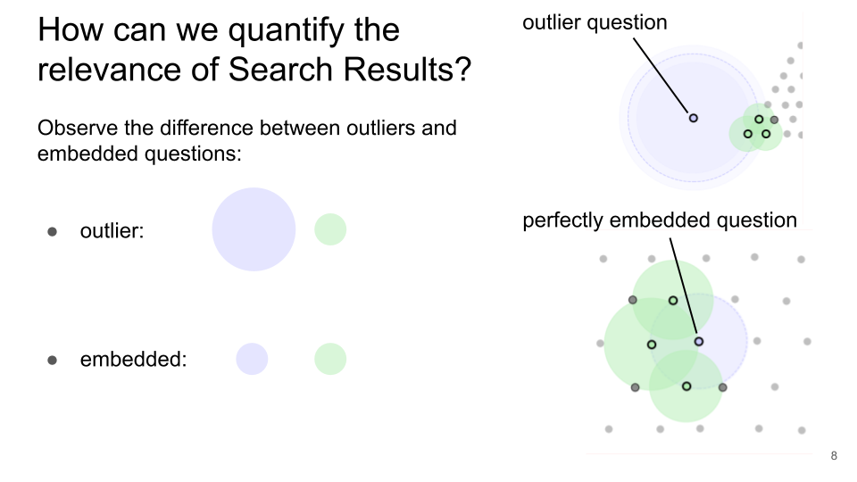

# About Search Engines, and how to find relevant answers in High Dimensional Swiss Cheese
LLMs always provide an answer, but the answer is not always correct. I wanted to develop something that tells you how well you can trust the answer. This is the Final Project of my WBS Data Science Bootcamp showcasing how Search Engines and LLMs can be enhanced with a relevance measure that indicates the relevance of search results with respect to the question you asked.

  
   
  
  

----
## Project
LLMs always provide an answer, but the answer is not always correct. I wanted to develop something that tells you how well you can trust the answer. This is the Final Project of my WBS Data Science Bootcamp showcasing how Search Engines and LLMs can be enhanced with a relevance measure that indicates the relevance of search results with respect to the question you asked.

The goal of this project was to develop and showcase a relevance measure for Search Engines and LLMs during a limited time of 2.5 weeks with a clearly defined deliverable using agile methods.  
 
The deliverable is the demonstration of the relevance measure, applied to theoretical, self generated data, i.e. homogeneous data points vs. in-homogeneous data points and to practical data, two search engines, each of them fed with a single book as their corpus. The relevance measure provides a number for search results or chatbot-answers between 0 and 1. A relevance number of 0 means that the search result is completely irrelevant, a relevance number of 1 means that the search result is completely relevant. 

The relevance measure is demonstrated for the **theoretical data** by representing a question as a data point in both a corpus of **homogeneous data points** and a corpus of **in-homogeneous data points**, determining the relevance number in both cases and comparing them for both cases. The results are shown on page 10-12 in [DS-029 Final Project - Presentation.pdf](DS-029%20Final%20Project%20-%20Presentation.pdf)

The relevance measure is demonstrated for the **practical data** by asking questions to two different search engines, each of them fed with a different book as its data. One search engine is fed with the book **Frankenstein** by Mary Shelley and the other search engine is fed with the book **1984** by George Orwell. Then five questions are asked to both search engines, two of which apply to the book Frankenstein, two other questions apply to the book 1984, and the final question has nothing to do with either of the two books. The resulting relevance numbers are listed in a table shown on page 15 in [DS-029 Final Project - Presentation.pdf](DS-029%20Final%20Project%20-%20Presentation.pdf).  

## Relevance Measure
The relevance measure provides a number for search results or chatbot-answers between 0 and 1. A relevance number of 0 means that the search result is completely irrelevant, a relevance number of 1 means that the search result is completely relevant. 

When we ask a question to a search engine or LLM the first thing that is done is that the question gets transformed into a data point in an n-dimensional vector space using an Embedding. 

An Embedding is an object that transforms text into a n-dimensional data point in a semantically meaningful way using a LLM. The n-dimensional vector space contains a lot of data points that together constitute the corpus or knowledge space of the search engine. Each data point resembles a piece of information. 

Having the question now embedded in the corpus, similarity search is used to find the nearest neighbors of the data point resembling the question.

An outlier question is a data point in the corpus who's nearest neighbors are relatively far away as compared to the average distance between any two points in the corpus.

A perfectly embedded question is a data point who's nearest neighbors are more or less the same as the average distance between any two points in the corpus.

   

Observing the asymmetry of the distances of an outlier question to its nearest neighbors and the distances of the nearest neighbors to their nearest neighbors and comparing this with the symmetric case for perfectly embedded questions, we can establish a relevance measure in the range 0 to 1.

## Key Learning

- Project planning and working using agile methods
- Creating a Minimum Viable Product and improving on it in an iterative process
- Developing a novel idea with a hard deadline
- Generating [Swiss Cheese Data](https://medium.com/@r.struikmans/how-to-make-n-dimensional-swiss-cheese-ef9401b8c1de)
- Explaining a complicated idea in layman's terms

## Languages, tools and libraries
- numpy
- pandas
- langchain
- LLMs
- Embeddings
- HuggingFace
- FAISS
- similarity search

## Data Sources
The books **Frankenstein** and **1984** are downloaded from
- https://www.gutenberg.org/
